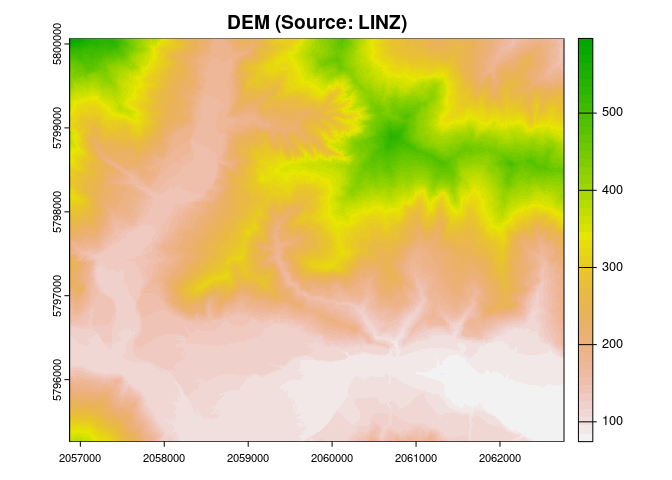
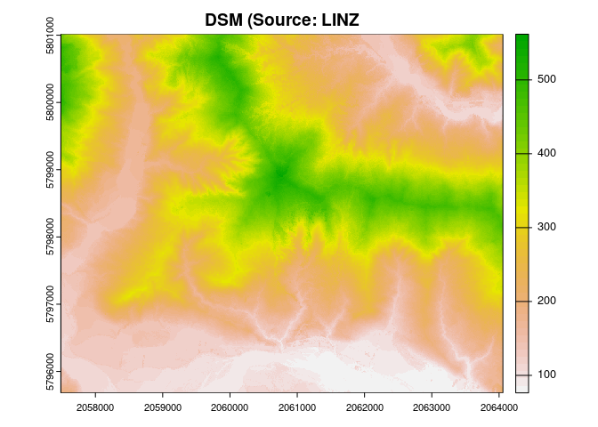
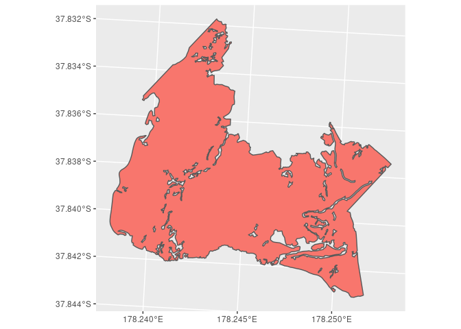
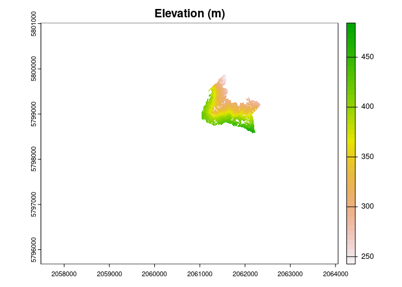
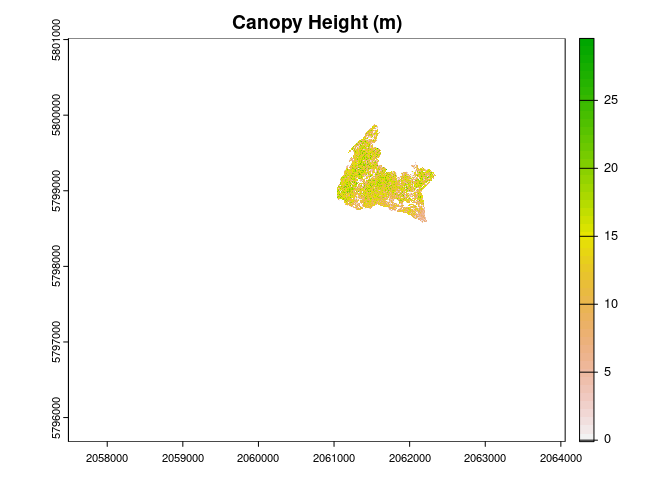
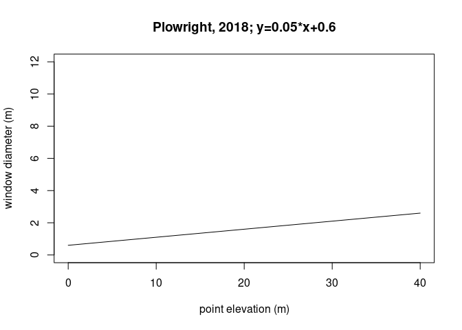
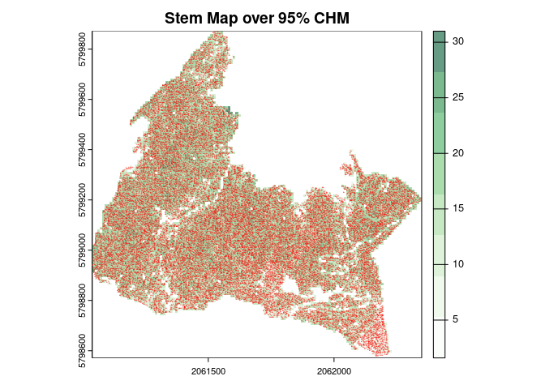
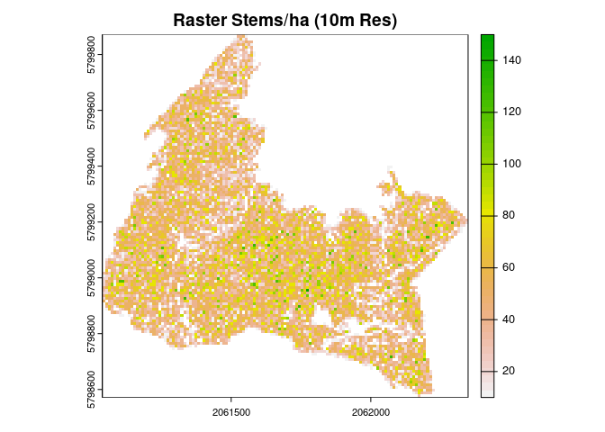

Hills Forest ReMapping
================
Summit-GIS
17/08/2023

- <a href="#action" id="toc-action">Action:</a>
- <a href="#input-aoi--masking-layers"
  id="toc-input-aoi--masking-layers">Input: AOI &amp; Masking layers</a>
- <a href="#input-variable-window-function"
  id="toc-input-variable-window-function">Input: Variable Window
  Function</a>
- <a href="#output-95-canopy-height--stem-count-layers"
  id="toc-output-95-canopy-height--stem-count-layers">Output: 95% Canopy
  Height &amp; Stem Count Layers</a>

## Action:

Some notes on the data processing steps and mapping outputs completed in
the remapping exercise of the Hills Forest Area. To map potential
differences between official data layers and newly LiDAR-derived
attributes, two variables were derived: ‘Stocking Density (stem/ha)’ &
‘Age Class’. Using DEM and DSM datasets sourced from the LINZ website, a
stem map was derived by applying a variable window algorithm and a
default taper function. With the stem map feature, two rasters were
calculated showing a canopy height model and stocking density per
hectare. This allowed comparison with values at StandID level.


\## 1. Inputs: LiDAR Projection

``` r
# Merge chunks
filez_dem = list.files("~/Desktop/Summit_Forestry/dem", full.names = T, all.files = FALSE, pattern = '.tif$') 
filez_dsm = list.files("~/Desktop/Summit_Forestry/dsm", full.names = T, all.files = FALSE, pattern = '.tif$') 
dem_raster_list <- lapply(filez_dem, raster)
dsm_raster_list <- lapply(filez_dsm, raster)
dem_raster = do.call(merge, c(dem_raster_list, tolerance = 1))
dsm_raster = do.call(merge, c(dsm_raster_list, tolerance = 1))
writeRaster(dem_raster, filename = "~/Desktop/Summit_Forestry/dem/dem_raster.tif", overwrite=TRUE)
writeRaster(dsm_raster, filename = "~/Desktop/Summit_Forestry/dsm/dsm_raster.tif", overwrite=TRUE)

# Rasterize and fill sinks
fill_sinks(dem = "dem_mosaic.tif", out = "dem_fill.tif", size = 1, overwrite = TRUE)
fill_sinks(dsm = "dsm_mosaic.tif", out = "dsm_fill.tif", size = 1, overwrite = TRUE)
writeRaster(dem_fill, filename = "~/Desktop/Summit_Forestry/dem/dem_filled.tif", overwrite=TRUE)
writeRaster(dsm_fill, filename = "~/Desktop/Summit_Forestry/dsm/dsm_filled.tif", overwrite=TRUE)

# Assign EPGS2193/NZGD2000
dem_rast = terra::rast(dem_filled)
dsm_rast = terra::rast(dsm_filled)
terra::crs(dem_rast) =  "epsg:2193"
terra::crs(dsm_rast) =  "epsg:2193"
terra::plot(dem_rast, main='DEM (Source: LINZ)') 
terra::plot(dsm_rast, main='DSM (Source: LINZ') 
```

## Input: AOI & Masking layers

``` r
# Derive mask from single cutblock shapefile: HILL-0341-009
mask_sf = sf::read_sf("~/Desktop/Summit_Forestry/stands/HILL-0341-009.shp")
mask_rast = rasterize(vect(mask_sf), dem_rast, touches = TRUE)
terra::crs(mask_rast) =  "epsg:2193"
ggplot(mask_sf) + geom_sf(aes(fill = 'red'), show.legend = FALSE)

# Align & apply mask
mask_rast = terra::resample(mask_rast, dsm_rast, method="near")
dem_rast = terra::resample(dem_rast, dsm_rast, method="near")
dem_masked = mask(dem_rast, mask_rast, inverse=FALSE)
dsm_masked = mask(dsm_rast, mask_rast, inverse=FALSE)
plot(dem_masked, main="DEM masked")
plot(dsm_masked, main = "DSM masked")

# Derive CHM & save all rasters
elev = dem_masked 
chm = dsm_masked - dem_masked
elev_raster = raster::raster(elev)
chm_raster = raster::raster(chm)
writeRaster(elev_raster, filename = "~/Desktop/Summit_Forestry/dem/elev_raster.tif", overwrite=TRUE)
writeRaster(chm_raster, filename = "~/Desktop/Summit_Forestry/dsm/chm_raster.tif", overwrite=TRUE)
plot(elev, main="Elevation (m)")
plot(chm, main="Canopy Height (m)")
```



## Input: Variable Window Function

``` r
# Used Plowright's window function as temporary fix here: 
# https://cran.r-project.org/web/packages/ForestTools/vignettes/treetop_analysis.html
wf_plowright<-function(x){ 
  a=0.05
  b=0.6 
  y<-a*x+b 
  return(y)}
heights <- seq(0,40,0.5)
window_plowright <- wf_plowright(heights)
plot(heights, window_plowright, type = "l", ylim = c(0,12), xlab="point elevation (m)", ylab="window diameter (m)", main='Plowright, 2018; y=0.05*x+0.6')
```



## Output: 95% Canopy Height & Stem Count Layers

``` r
kernel <- matrix(1,3,3)
chm_raster = focal(chm, w = kernel, fun = median, na.rm = TRUE) %>% raster()
ttops_1.5mfloor_plowright = ForestTools::vwf(chm_raster, wf_plowright, 1.5)
writeOGR(ttops_1.5mfloor_plowright, "~/Desktop/Summit_Forestry/stands", "treetops_hills_009_masked", driver = "ESRI Shapefile") 

quant95 <- function(x, ...) 
  quantile(x, c(0.95), na.rm = TRUE)
custFuns <- list(quant95, max)
names(custFuns) <- c("95thQuantile", "Max")

# Derive output rasters and assign resolution
ttops_1.5mfloor_height <- ForestTools::sp_summarise(ttops_1.5mfloor_plowright, grid = 10, variables = "height", statFuns = custFuns)
stem_count_raster = ttops_1.5mfloor_height[["TreeCount"]]
chm_95height_raster = ttops_1.5mfloor_height[["height95thQuantile"]]
raster::writeRaster(chm_95height_raster, filename = "~/Desktop/Summit_Forestry/stands/chm_95height_10m.tif", overwrite=TRUE)
raster::writeRaster(stem_count_raster, filename = "~/Desktop/Summit_Forestry/stands/stem_count_10m.tif", overwrite=TRUE)

mypalette<-brewer.pal(8,"Greens")
stem_count_rast = terra::rast(stem_count_raster)
stem_count_ha = 10*stem_count_rast
chm_95height_rast = terra::rast(chm_95height_raster)
stem_count_ha_sf = st_as_sf(ttops_1.5mfloor_plowright)
{plot(chm_95height_rast, col = mypalette, alpha=0.6, main="Stem Map over 95% CHM")  
plot(st_geometry(stem_count_ha_sf["treeID"]), cex = 0.2, pch="+", col = 'red', lwd=1, alpha=1, add=TRUE) }
plot(stem_count_ha, main="Raster Stems/ha (10m Res)")
```

    ## OGR data source with driver: ESRI Shapefile 
    ## Source: "/home/seamus/Desktop/Summit_Forestry/stands", layer: "treetops_hills_009_masked"
    ## with 34585 features
    ## It has 3 fields


